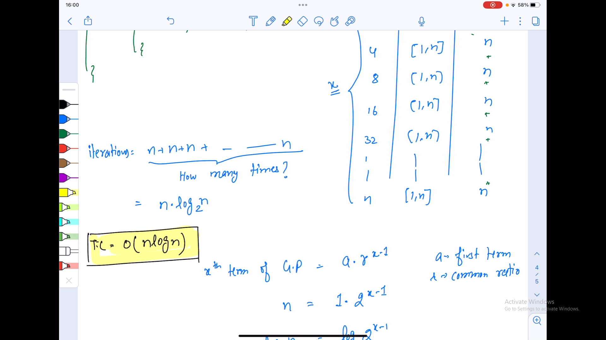

## Q4. Find Time Complexity - 7 - Objective

### What is the time complexity of the following code :

```
for (int i = 1; i <= n; i *= 2) {
    for (int j = 1; j <= n; j++) {
        System.out.print(i + j + " ");
    }
    System.out.println();
}
```

### Answer
O(nlogn)
### Explanation
